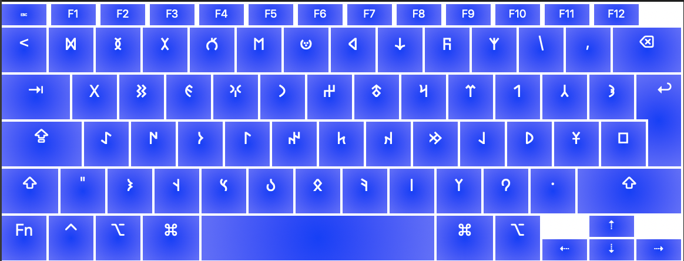

# Old Turkic Keyboard Layout

This is an experimental layout that includes all the glyphs in the Unicode Old Turkic range.

Occurences of the tamgas have been taken into account whilst determining the locations of the glyphs. Following manuscripts have been analysed:

- Irk Bitig manuscript
- Kül Tigin monument
- Bagadur Çigşi manuscript

Available for macOS, Linux, and Windows.

